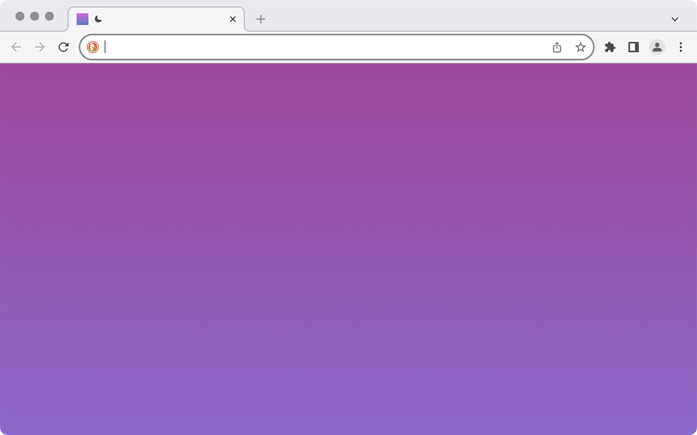

# Blank sky

Beautiful twilight sky inspired new tab page replacement for your browser.

Minimalistic new tab page with a random color gradient that looks like a twilight sky. No ads, no useless links or buttons, just sky, clear sky...

**[Open the page](https://sky.morning.photos/)**

Check out my browser UI theme that works well with Blank Sky:
https://sapegin.me/squirrelsong/

Consider buying me a cup of coffee:
https://www.buymeacoffee.com/sapegin

## Authors and license

[Artem Sapegin](https://sapegin.me) and [contributors](https://github.com/sapegin/blank-sky/graphs/contributors).

MIT License, see the included [License.md](License.md) file.
